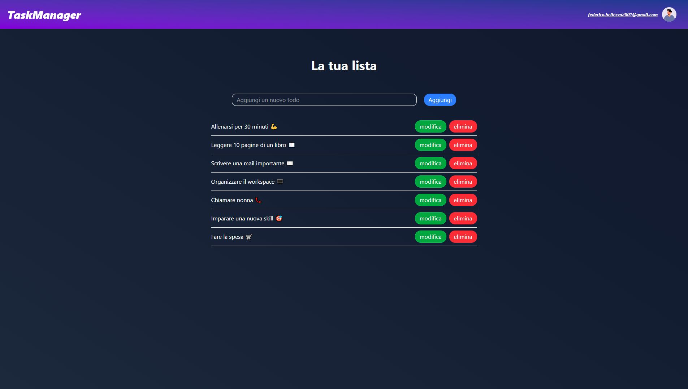

# Task Manager con Next.js e Supabase 🚀

Benvenuto nel mio progetto **Task Manager**! Questo progetto è stato sviluppato utilizzando **Next.js** e **Supabase** per creare un'applicazione moderna e funzionale per la gestione delle attività. 💼📝

## 📝 Descrizione del Progetto

Il Task Manager è un'applicazione web che permette agli utenti di gestire le proprie attività in modo semplice e intuitivo. Include funzionalità di autenticazione sicura e gestione degli stati per un'esperienza utente ottimale. 🌱

### ✨ Funzionalità Principali

- **Autenticazione tramite email e password** 📧🔒
- **CRUD completo per le attività** (creazione, lettura, aggiornamento e cancellazione) ✅
- **Sicurezza avanzata con Row Level Security (RLS)** 🔐
- **Esperienza utente fluida grazie a pagine di loading** 🚀
- **Gestione degli stati tramite contesto di React** ⚛️

## 📦 Tecnologie Utilizzate

- **Next.js** - Framework React per applicazioni full-stack
- **Supabase** - Backend-as-a-Service (BaaS) per autenticazione e database
- **Tailwind CSS** - Styling moderno e responsivo
- **Vercel** - Deploy rapido e scalabile

## 🚀 Cosa Ho Imparato

### **Next.js**

- Inizializzazione del progetto
- Gestione delle rotte e del layout
- Componenti Server-side e Client-side
- Creazione di un contesto per la gestione dello stato
- Miglioramento dell'esperienza utente con pagine di loading

### **Supabase**

- Configurazione del progetto e gestione dei dati sensibili tramite .env
- Autenticazione sicura e autorizzazione degli utenti
- Chiamate API: GET, POST, DELETE, UPDATE
- Implementazione del Row Level Security (RLS) per proteggere i dati degli utenti

## 🌍 Deploy

Il progetto è stato distribuito su Vercel, rendendolo accessibile da qualsiasi dispositivo connesso a Internet.
👉 **Link al sito:** [Task Manager](https://next-todo-list-swart.vercel.app/)
